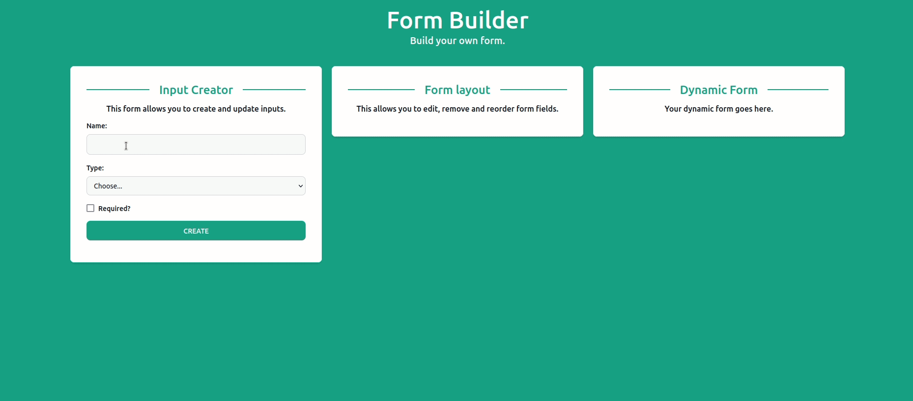

# Table of Content

- [Table of Content](#table-of-content)
  - [1. Project Structure](#1-project-structure)
  - [2. Libraries & Frameworks](#2-libraries--frameworks)
  - [3. Installation & Set Up](#3-installation--set-up)
  - [4. License](#4-license)

## 1. Project Structure

```bash
├── components
│   ├── atoms                  #Frequently used components
│   │   ├── CardHeader.tsx
│   │   ├── Card.tsx
│   │   ├── CheckboxField.tsx
│   │   ├── index.ts
│   │   ├── RadioGroup.tsx
│   │   ├── SelectField.tsx
│   │   ├── TextField.tsx
│   │   └── TextMd.tsx
│   └── molecules              #Components composed of more than one atom
│       ├── Form
│       │   └── index.tsx
│       ├── FormLayout
│       │   ├── index.tsx
│       │   └── Item.tsx
│       └── InputCreator
│           └── index.tsx
├── lib                        #Store and helpers functions
│   ├── helpers.ts
│   └── store.ts
├── next.config.js
├── next-env.d.ts
├── package.json
├── package-lock.json
├── pages
│   ├── _app.tsx
│   └── index.tsx
├── postcss.config.js
├── preview.gif
├── public
│   └── favicon.ico
├── README.md
├── styles
│   └── globals.css
├── tailwind.config.js
├── tsconfig.json
└── types                      #TypeScript types
    └── index.ts

```

## 2. Libraries & Frameworks

| Name                                                      | Description                                                            |
| --------------------------------------------------------- | ---------------------------------------------------------------------- |
| [NextJS](https://nextjs.org/)                             | The React Framework for Production.                                    |
| [React Hook Form](https://react-hook-form.com/)           | Performant, flexible and extensible forms with easy-to-use validation. |
| [Zustand](https://zustand-demo.pmnd.rs/)                  | A small, fast and scalable bearbones state-management solution         |
| [React Icons](https://react-icons.github.io/react-icons/) | Include popular icons in your React projects easily                    |
| [Framer Motion](https://framer.com/motion)                | Open source, production-ready animation and gesture library for React  |
| [uuid](https://github.com/uuidjs/uuid)                    | Generate random Universally unique identifier (UUID)                   |

## 3. Installation & Set Up

1. Install project dependencies

```bash
  yarn install or npm install
```

2. Start the development server

```bash
  yarn dev or npm run dev
```

3. Build for production

```bash
  yarn build or npm run build
```

4. Run production mode

```bash
  yarn start or npm start
```

## 4. License

MIT © [Rahim Guerfi](https://github.com/RahimGuerfi)
